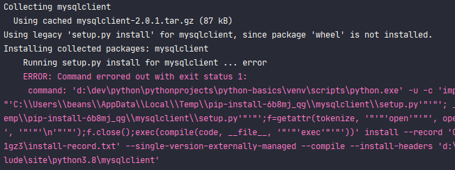

# django-basics
BIT - 장고

## 장고 세팅
1. 설치
```commandline
pip install django
```

2. mysqlclient 설치
```commandline
pip install mysqlclient
```

3. 장고 프로젝트 생성
(장고프로젝트 안에서)
```commandline
django-admin startproject [프로젝트이름]
```
4. 어플리케이션 설치
> 장고는 프로젝트영역과 어플리케이션 영역을 구분해주어야 한다. 

(장고프로젝트 안에서)
```commandline
python manage.py startapp [만들려는 어플리케이션 이름] 
```

5. settings.py 에서 ..
### 생성한 어플리케이션 등록
INSTALLED_APPS = [].. 부분에 생성한 어플리케이션 추가

### 타임존 변경
TIME_ZONE .. 부분을 'Asia/Seoul'로 변경

### 데이터베이스 변경
> mysql, mongoDB 등등.. 가능 (default는 sqlite)
  
DATABASES = {}.. 부분을 수정
> 데이터베이스 관련 변경사항은 반드시 장고에 반영해야주어야 한다.
```commandline
python manage.py migrate
```

### 서버 실행
```commandline
python manage.py runserver 0000:8000
```

## mysqlclient 설치 에러
  
위와 같은 에러는 다음과 같은과정으로 고친다.
1. python의 버전 확인
```python
import platform
print(platform.architecture())
```
2. 위 명령어로 파이썬 비트 확인
3. [링크](https://www.lfd.uci.edu/~gohlke/pythonlibs/#mysqlclient) 로 접속해서 해당 버전에 맞는 것을 다운로드  
4. 위 프로그램을 다운로드한 경로에서 pip install [받은파일 이름]

  
